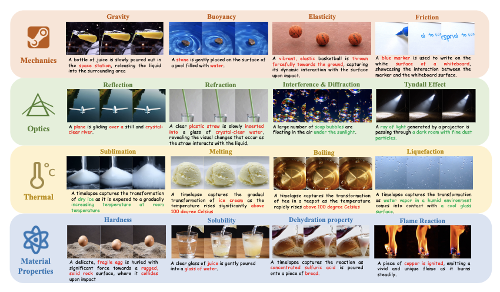
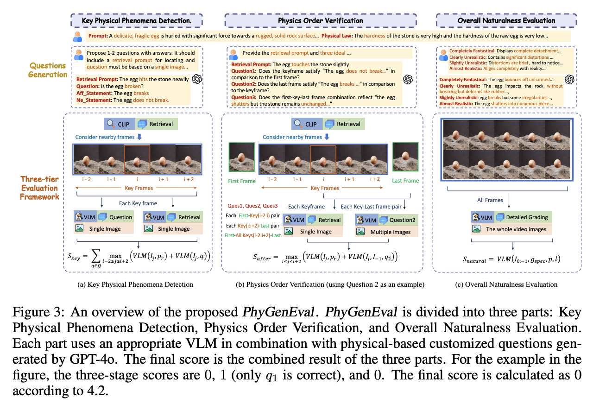
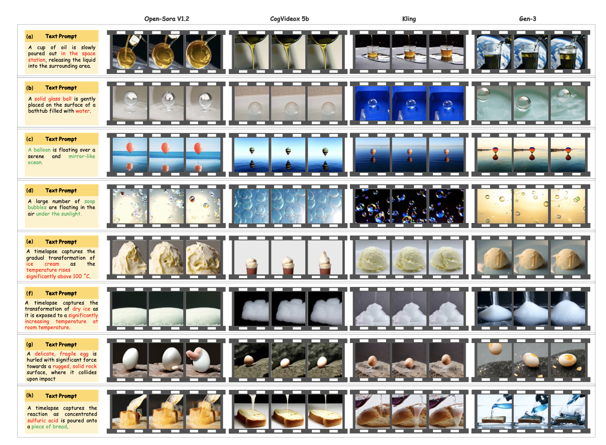

# PhyGenBench

<p align="left">
  <a href="#🚀-quick-start"><b>Quick Start</b></a> |
  <a href="https://mmiu-bench.github.io/"><b>HomePage</b></a> |
  <a href="https://arxiv.org/abs/2408.02718"><b>arXiv</b></a> |
</a> 
  <a href="#🖊️-citation"><b>Citation</b></a> <br>
</p>

This repository is the official implementation of [PhyGenBench]([https://arxiv.org/abs/2408.02718](https://github.com/OpenGVLab/PhyGenBench)). 

> [Towards World Simulator: Crafting Physical Commonsense-Based Benchmark for Video Generation]([https://arxiv.org/abs/2408.02718](https://github.com/OpenGVLab/PhyGenBench))  
> Fanqing Meng<sup>\*</sup>, Jiaqi Liao<sup>\*</sup>, Xinyu Tan, Wenqi Shao<sup>\#</sup>, Quanfeng Lu, Kaipeng Zhang, Cheng Yu, Dianqi Li, Yu Qiao, Ping Luo<sup>\#</sup>  
> <sup>\*</sup> MFQ and LJQ contribute equally.  
> <sup>\#</sup> SWQ (shaowenqi@pjlab.org.cn) and LP are correponding authors. 

## 💡 News

- `2024/10/07`: We have released the codes and data. 


## 🎩Introduction 

We introduce **PhyGenBench**, a comprehensive **Phy**sics **Gen**eration **Bench**mark designed to evaluate physical commonsense correctness in T2V generation. PhyGenBench comprises 160 carefully crafted prompts across 27 distinct physical laws, spanning four fundamental domains, which could comprehensively assesses models' understanding of physical commonsense. Alongside PhyGenBench, we propose a novel evaluation framework called **PhyGenEval**. This framework employs a hierarchical evaluation structure utilizing appropriate advanced vision-language models and large language models to assess physical commonsense. Through PhyGenBench and PhyGenEval, we can conduct large-scale automated assessments of T2V models' understanding of physical commonsense, which align closely with human feedback. Our evaluation results and in-depth analysis demonstrate that current models struggle to generate videos that comply with physical commonsense. Moreover, simply scaling up models or employing prompt engineering techniques is insufficient to fully address the challenges presented by PhyGenBench (e.g., dynamic physical phenomenons). We hope this study will inspire the community to prioritize the learning of physical commonsense in these models beyond entertainment applications.




## 📖PhyGenEval



we design a progressive strategy that starts with key physical phenomena, then moves through the sequence of several key phenomena, and finally evaluates the overall naturalness of the entire video. This hierarchical and refined approach reduces the difficulty compared to existing methods that directly uses VLMs to evaluate physical commonsense, enabling PhyGenEval to achieve results closely aligned with human judgements.


## 🏆 Leaderboard


| Model            | Size  | Mechanics(↑) | Optics(↑) | Thermal(↑) | Material(↑) | Average(↑) | Human(↑) |
|------------------|-------|--------------|-----------|------------|-------------|------------|----------|
| CogVideoX        | 2B    | 0.38         | 0.43      | 0.34       | 0.39        | 0.37       | 0.31     |
| CogVideoX        | 5B    | 0.43         | 0.55      | 0.40       | 0.42        | 0.45       | 0.37     |
| Open-Sora V1.2   | 1.1B  | 0.43         | 0.50      | 0.44       | 0.37        | 0.44       | 0.35     |
| Lavie            | 860M  | 0.40         | 0.44      | 0.38       | 0.32        | 0.36       | 0.30     |
| Vchitect 2.0     | 2B    | 0.41         | 0.56      | 0.44       | 0.37        | 0.45       | 0.36     |
| Pika             | -     | 0.35         | 0.56      | 0.43       | 0.39        | 0.44       | 0.36     |
| Gen-3            | -     | **0.45**         | 0.57      | 0.49       | **0.51**        | **0.51**       | **0.48**     |
| Kling            | -     | **0.45**         | **0.58**      |** 0.50**       | 0.40        | 0.49       | 0.44     |


## 🚀 Quick Start

### File Structure
- PhyGenBench, which includes the test prompt: prompts.json
- PhyGenBench also includes the example problems we showcase in three different stages
- PhyGenEval includes the semantic evaluation method, as well as the three-stage physical commonsense evaluation methods: single, multi, video
- result contains the results of Kling's test on PhyGenBench
- PhyVideos contains the videos to be tested. Please generate the videos according to prompts.json and place them here.
	- For example, for Kling, name the files as output_video_{index+1}.mp4, where index corresponds to the prompt number in prompts.json

### Environment

```
git clone https://github.com/OpenGVLab/PhyGenBench
cd PhyGenBench
```


- For our evaluation process, whether using GPT-4o or open-source models, both start at the **First stage: Key Physical Phenomena Detection** and use **VQAScore**.

You can refer to the [official repo](https://github.com/linzhiqiu/t2v_metrics) for details.

- **Second Stage: Physics Order Verification**: For our closed-source model, we use GPT-4o (only requires API configuration), and for the open-source model, we use **LLava-Interleave-dpo-7B**.

Please refer to the [official repo](https://github.com/LLaVA-VL/LLaVA-NeXT) for details.

- **Third stage: Overall Naturalness Evaluation**: For the closed-source model, we use GPT-4o (only requires API configuration), and for the open-source model, we use **InternVideo2**, which is the same model used by [ChronoMagic-Bench](https://github.com/PKU-YuanGroup/ChronoMagic-Bench).

We use the same environment with [ChronoMagic-Bench](https://github.com/PKU-YuanGroup/ChronoMagic-Bench). The model ckp is at [huggingface](https://huggingface.co/OpenGVLab/InternVideo2-Stage2_1B-224p-f4).

If you only want to use the closed-source model for testing, you only need to configure the VQAScore environment. If you want to perform an ensemble of both closed-source and open-source models, you need to configure VQAScore, LLava-Interleave, and InternVideo2 environments, and download the models.


### Question Generation

First, we generate corresponding questions for Key Physical Phenomena Detection, Physics Order Verification, and Overall Naturalness Evaluation. To simplify the expression, we refer to them as the single stage, multi stage, and video stage based on the VLM used.

```
# single
python PhyGenEval/single/generate_question.py

# multi
python PhyGenEval/multi/generate_question.py

# video
python PhyGenEval/video/generate_question.py
```

single_question.json, multi_question.json, and video_question.json in PhyGenBench is the questions we used.


### Three-tier Evaluation

**Key Physical Phenomena Detection:**

```
python PhyGenEval/single/vqascore.py
```

**Physics Order Verification:**

```
# the environment of vqascore make collide with environment with llava-interleave,
# so we first retrieval the keyframe and then do the multi-image qa

# first do the retrieval and denote the retrieval score
# the environment is same with vqascore

python PhyGenEval/multi/multiimage_clip.py

# then do the multi-image qa
# for gpt-4o
python PhyGenEval/multi/GPT4o.py

# for llava
cd PhyGenEval/multi/LLaVA-NeXT-interleave_inference
python llava/eval/model_vqa_multi.py
```

**Overall Naturalness Evaluation**

```
# for gpt4o
python PhyGenEval/video/GPT4o.py

# for internvideo2
cd PhyGenEval/video/MTScore
python InternVideo_physical.py
```

**Overall Score**

```
python PhyGenEval/overall.py
```


## 🎬Qualitative Analysis




## 📧 Contact
If you have any questions, feel free to contact Fanqing Meng with mengfanqing33@gmail.com


